# 🚀 DLMM LP Copilot - Saros Finance Demo

> **🌐 Live Demo:** [https://saros-dlmm-web.vercel.app/](https://saros-dlmm-web.vercel.app/)  
> **🎥 Demo Video:** *(Coming Soon - Will be updated)*  
> **💰 Built for Sar```bash
# Root configuration
cp .env .env.local

# Strategy service setup
cp services/strategy/.env services/strategy/.env.local
# Configure: SOLANA_RPC_URL, MOCK_MODE, CORS_ORIGINS

# Telegram bot setup  
cp apps/bot/.env apps/bot/.env.local
# Set: TELEGRAM_BOT_TOKEN, ALLOWLIST_IDS, DEFAULT_WALLET

# Web application setup
cp apps/web/.env apps/web/.env.local
# Configure: NEXT_PUBLIC_STRATEGY_URL, NEXT_PUBLIC_BOT_HEALTH_URL
```

---

## 🎮 API Reference

### **Core Rebalancing Endpoints**
```bash
# Plan optimal rebalancing strategy
POST /rebalance/plan
{
  "wallet": "your_wallet_address",
  "pool": "POOL_SOL_USDC", 
  "bandBps": 100
}

# Execute rebalancing transaction
POST /rebalance/execute
{
  "wallet": "your_wallet_address",
  "pool": "POOL_SOL_USDC",
  "bandBps": 100
}
```

### **Advanced Orders API**
```bash
# Plan advanced order (limit/stop-loss)
POST /orders/advanced/plan
{
  "wallet": "your_wallet_address",
  "pool": "POOL_SOL_USDC",
  "orderType": "LIMIT",
  "triggerPrice": 150.0,
  "amount": 1000
}

# Arm/Disarm advanced orders
POST /orders/advanced/arm
POST /orders/advanced/disarm
```

### **Telegram Integration API**
```bash
# Generate wallet link code
POST /bot/link-code
{ "wallet": "your_wallet_address" }

# Bind Telegram user to wallet
POST /bot/consume-link  
{ "code": "ABCD1234", "telegramId": 123456789 }

# Resolve linked wallet
GET /bot/wallet/:telegramId
```

---

## 🏆 Bounty Evaluation Criteria

### ✅ **Functionality & User Experience**
- **Intuitive Interface** - Clean, modern UI with smooth user interactions
- **Mobile-First Design** - Responsive design optimized for all devices
- **Real-time Updates** - Live data feeds and instant feedback on actions
- **Error Handling** - Comprehensive error messages and recovery options

### ✅ **Code Quality & Documentation**  
- **Production-Ready Code** - Clean, maintainable codebase with TypeScript
- **Comprehensive Testing** - Mock mode for safe testing and development
- **Clear Documentation** - Detailed README, API docs, and code comments
- **Best Practices** - ESLint, Prettier, and modern development standards

### ✅ **Creative SDK Usage**
- **Deep DLMM Integration** - Advanced usage of `@saros-finance/dlmm-sdk`
- **Innovative Features** - Telegram bot integration for mobile DeFi
- **Advanced Order Types** - Creative use of DLMM bins for limit orders
- **Analytics Engine** - Custom backtesting and performance analysis

### ✅ **Real-World Applicability**
- **Production Deployment** - Live application on Vercel and Render
- **Practical Use Cases** - Tools that liquidity providers actually need
- **Scalable Architecture** - Microservices design for enterprise adoption
- **Educational Value** - Other developers can learn from the implementation

### ✅ **Hackathon Foundation Potential**
- **Modular Design** - Easy to extend and build upon
- **Open Source** - MIT license for community contributions  
- **Plugin Architecture** - Extensible for additional features
- **Documentation** - Clear setup and extension guides

---

## 🌟 Innovation Highlights

### **🚀 First-of-Its-Kind Features**
- **Telegram DeFi Bot** - Mobile-first LP management through messaging
- **Advanced Order Engine** - Limit orders using DLMM bin mechanics
- **Integrated Analytics** - Backtesting with real position simulation  
- **Wallet Link System** - Secure cross-platform wallet connectivity

### **🎯 SDK Showcase Excellence**
- **Comprehensive DLMM Usage** - Utilizes all major SDK features
- **Performance Optimization** - Efficient batch operations and caching
- **Error Recovery** - Robust handling of blockchain uncertainties  
- **Real-time Integration** - Live blockchain data with WebSocket updates

---

## 🛡️ Safety & Testing

### **Mock Mode (Default)**
All transactions default to **MOCK_MODE=true** for safe development:
- Deterministic mock transaction IDs (`MOCK-xxxxx`)
- Safe wallet validation without real funds
- Complete feature testing without blockchain costs

### **Production Mode**
Switch to live mode by configuring:
```bash
MOCK_MODE=false
SOLANA_RPC_URL=your_mainnet_rpc
WALLET_PRIVATE_KEY=your_signing_key
```

---

## 🚀 Deployment Architecture

### **Frontend (Vercel)**
- **Framework:** Next.js 14 with TypeScript
- **Styling:** Tailwind CSS with custom components
- **State Management:** Zustand for client state
- **Analytics:** Recharts for data visualization

### **Backend Services (Render)** 
- **Strategy API:** Fastify server with CORS configuration
- **Bot Service:** Telegraf-powered Telegram integration
- **Database:** File-based storage with planned PostgreSQL upgrade

### **Core Package**
- **SDK Integration:** `@saros-finance/dlmm-sdk` wrapper
- **Shared Logic:** Business logic and utilities
- **Type Safety:** Full TypeScript coverage with Zod validation

---

## 📈 Future Roadmap

### **Phase 1: Enhanced Analytics**
- Real-time position monitoring with alerts
- Advanced backtesting with multiple strategies
- Portfolio optimization recommendations

### **Phase 2: Advanced Automation** 
- Keeper network for automated rebalancing
- Signal integration from external data sources
- Dynamic fee optimization based on market conditions

### **Phase 3: Enterprise Features**
- Multi-user support with role-based access
- API rate limiting and usage analytics  
- White-label solutions for other protocols

---

## 🤝 Contributing

We welcome contributions from the community! This project serves as a foundation for the upcoming **$100K Saros Hackathon**.

### **How to Contribute**
1. Fork the repository
2. Create a feature branch (`git checkout -b feature/amazing-feature`)
3. Commit your changes (`git commit -m 'Add amazing feature'`)
4. Push to the branch (`git push origin feature/amazing-feature`)
5. Open a Pull Request

---


## 📄 License

This project is licensed under the **MIT License** - see the [LICENSE](LICENSE) file for details.

Built with ❤️ for the Saros Finance community and the future of DeFi automation.

---

## 🎯 Quickstart - *Automated LP Management & Advanced Trading Tools*

---

## 🏆 Project Overview

**DLMM LP Copilot** is a comprehensive DeFi automation platform built for the **Saros Finance DLMM SDK Bounty**. This production-ready application showcases the full potential of Saros's Dynamic Liquidity Market Maker (DLMM) technology through an integrated ecosystem of web dashboard, strategy automation, and Telegram bot.

### 🎯 Bounty Submission Highlights

**🏅 Multi-Feature Demo Application** - Complete ecosystem with web interface, REST API, and Telegram integration  
**⚡ Advanced DLMM Integration** - Deep integration with `@saros-finance/dlmm-sdk` for position management  
**🌐 Live Production Deployment** - Fully deployed on Vercel with backend services on Render  
**📊 Real-World Utility** - Practical tools that LPs actually need for DLMM management  
**🤖 Innovation Factor** - First-of-its-kind Telegram bot for DeFi position management  

---

## ✨ Key Features & Innovations

### 🎛️ **Advanced Position Management**
- **Smart Rebalancing Engine** - Automated band adjustment based on market conditions
- **Advanced Order Types** - Limit orders, stop-loss, and take-profit using DLMM bin mechanics
- **Real-time Analytics** - Comprehensive position tracking and performance metrics

### 🤖 **Telegram Integration** 
- **One-Tap Wallet Linking** - Secure wallet connection via deep links
- **Mobile-First Trading** - Execute rebalances and manage positions from anywhere  
- **Smart Notifications** - Real-time alerts for position changes and opportunities

### 📊 **Analytics & Backtesting Suite**
- **CSV Data Import** - Historical analysis with custom price feeds
- **Strategy Simulation** - Backtest different LP strategies with fee calculations
- **Performance Visualization** - Interactive charts showing equity curves and metrics

### 🔐 **Production-Ready Architecture**
- **Mock Mode Safety** - Comprehensive testing environment before live trading
- **Error Handling** - Robust error management and user feedback systems
- **Scalable Design** - Microservices architecture ready for enterprise use

---

## 🛠️ Technical Implementation

### **Core SDK Integration**
```typescript
// Deep DLMM SDK integration for position management
import { DLMM } from '@saros-finance/dlmm-sdk';

// Smart rebalancing with bin-level precision
const rebalanceResult = await dlmmPosition.rebalance({
  newRange: { lower: targetLower, upper: targetUpper },
  liquidityAmount: calculatedLiquidity
});
```

### **Advanced Order Engine**
```typescript
// Innovative limit order implementation using DLMM bins
const limitOrder = await planAdvancedOrder({
  type: 'LIMIT',
  triggerPrice: targetPrice,
  binStrategy: 'CONCENTRATED',
  slippageTolerance: 0.1
});
```

---

## 🏗️ Architecture

```mermaid
graph TB
    subgraph "Frontend Layer"
        Web[🌐 Next.js Dashboard<br/>Analytics & Trading UI]
        TG[📱 Telegram Bot<br/>Mobile Trading Interface]
    end
    
    subgraph "Backend Services"
        Strategy[⚡ Strategy Service<br/>Fastify REST API]
        Bot[🤖 Bot Service<br/>Telegram Integration]
    end
    
    subgraph "Core Layer"
        Core[📦 Core Package<br/>Shared Business Logic]
        SDK[🎯 Saros DLMM SDK<br/>Blockchain Integration]
    end
    
    subgraph "Infrastructure"
        Vercel[☁️ Vercel<br/>Frontend Hosting]
        Render[🔧 Render<br/>Backend Services]
        Solana[⛓️ Solana Blockchain<br/>DLMM Protocols]
    end
    
    Web --> Strategy
    TG --> Bot
    Bot --> Strategy
    Strategy --> Core
    Core --> SDK
    SDK --> Solana
    
    Web -.-> Vercel
    Strategy -.-> Render
    Bot -.-> Render
```



---

## 🚀 Quick Start

### **1. Live Demo (Recommended)**
Visit the deployed application: **[https://saros-dlmm-web.vercel.app/](https://saros-dlmm-web.vercel.app/)**

### **2. Local Development**
```bash
# Install dependencies
pnpm install

# Start all services
pnpm dev  # Runs web, strategy, and bot concurrently

# Individual services
pnpm --filter @dlmm-copilot/web dev      # Frontend :3000
pnpm --filter @dlmm-copilot/strategy dev # API :4000  
pnpm --filter @dlmm-copilot/bot dev      # Bot :4001
```

### **3. Health Checks**
```bash
curl http://localhost:4000/health  # Strategy API
curl http://localhost:4001/health  # Bot Service
open http://localhost:3000         # Web Dashboard
```

---

## 📱 Demo Walkthrough

### **Web Dashboard Features**
1. **📊 Analytics Page** - Real-time position tracking and performance metrics
2. **💼 Portfolio Management** - Comprehensive view of all DLMM positions  
3. **🎯 Advanced Orders** - Set up limit orders and stop-loss strategies
4. **🔗 Telegram Integration** - Link your wallet for mobile trading

### **Telegram Bot Commands**
- `/start` - Initialize bot and view available commands
- `/link <CODE>` - Connect your wallet using link code from dashboard
- `/status` - Check bot connectivity and wallet status  
- `/rebalance` - Execute smart rebalancing with current settings
- `/widen <bps>` - Adjust position bands (e.g., `/widen 150`)

---

## 🔧 Configuration & Environment Setup

Devnet defaults live in the root `.env` (shared) and each package's `.env`.
Devnet defaults live in the root `.env` (shared) and each package's `.env`.

```bash
# Root (shared defaults)
cp .env .env.local

# Strategy service
cp services/strategy/.env services/strategy/.env.local
# edit to set SOLANA_RPC_URL, BOT_USERNAME (for deep links), MOCK_MODE

# Telegram bot
cp apps/bot/.env apps/bot/.env.local
# set TELEGRAM_BOT_TOKEN, ALLOWLIST_IDS, DEFAULT_WALLET (linked wallet)

# Web app (Next.js)
cp apps/web/.env apps/web/.env.local
# ensures NEXT_PUBLIC_STRATEGY_URL=http://localhost:4000 etc.
```stack for Saros Finance's Dynamic Liquidity Market Maker (DLMM). It combines a browser dashboard, a strategy API, and a Telegram bot so liquidity providers can rebalance bands, stage advanced orders, and monitor positions from anywhere.

## What We Built
- **Strategy Rebalancer** – calculates target bands, executes mock transactions, and exposes REST endpoints.
- **Advanced Orders** – plan/arm/disarm limit & stop orders with SDK-driven bin selection.
- **Telegram Companion** – one-tap wallet linking to reuse the same wallet for chat commands.
- **Analytics & Backtests** – CSV-driven simulator to explore “what-if” rebalancing strategies.

## Architecture
```mermaid
flowchart LR
    subgraph Client
        Web[Next.js 14 Web App]
        Telegram[Telegram Bot (Telegraf)]
    end
    subgraph Services
        Strategy[Fastify Strategy Service]
    end
    subgraph Core SDK
        Core[@dlmm-copilot/core\n + @saros-finance/dlmm-sdk]
    end
    Solana[(Solana Devnet)]

    Web -->|REST /bot/*, /rebalance/*| Strategy
    Telegram -->|REST /bot/*| Strategy
    Strategy -->|DLMM SDK| Core
    Core --> Solana
```

## Key SDKs & Libraries
- [`@saros-finance/dlmm-sdk`](https://www.npmjs.com/package/@saros-finance/dlmm-sdk) for pool math and positions.
- [`@solana/web3.js`](https://solana-labs.github.io/solana-web3.js) for wallet validation & RPC calls.
- [`fastify`](https://fastify.io/), [`telegraf`](https://telegraf.js.org/), [`next`](https://nextjs.org/), [`zod`](https://zod.dev/).

## Safety & MOCK_MODE
The repo defaults to **MOCK_MODE=true**. All rebalance/advanced order executions return deterministic `MOCK-` transaction IDs. Wallets are validated with Solana base58 rules; in mock mode the literal `WALLET_MOCK` maps to `11111111111111111111111111111111`. Switch to live mode by setting `MOCK_MODE=false` in `services/strategy/.env.local` and supplying a real RPC + wallet signer.

## Environment Setup
Devnet defaults live in the root `.env` (shared) and each package’s `.env`.

```bash
# Root (shared defaults)
cp .env .env.local

# Strategy service
cp services/strategy/.env services/strategy/.env.local
# edit to set SOLANA_RPC_URL, BOT_USERNAME (for deep links), MOCK_MODE

# Telegram bot
cp apps/bot/.env apps/bot/.env.local
# set TELEGRAM_BOT_TOKEN, ALLOWLIST_IDS, DEFAULT_WALLET (linked wallet)

# Web app (Next.js)
cp apps/web/.env apps/web/.env.local
# ensures NEXT_PUBLIC_STRATEGY_URL=http://localhost:4000 etc.
```

## Quickstart
```bash
pnpm install

# start each service in its own terminal
pnpm --filter @dlmm-copilot/strategy dev   # Fastify on :4000
pnpm --filter @dlmm-copilot/bot dev        # Telegram bot on :4001
pnpm --filter @dlmm-copilot/web dev        # Next.js on :3000
```

Verify health checks:
```bash
curl -s http://localhost:4000/health | jq
curl -s http://localhost:4001/health | jq
open http://localhost:3000
```

## Strategy API Overview
| Endpoint | Method | Description |
| --- | --- | --- |
| `/health` | GET | Service status, mock flag, RPC connectivity |
| `/price/:pool` | GET | Current mid price for a pool |
| `/rebalance/plan` | POST | Compute target band bounds |
| `/rebalance/execute` | POST | Execute rebalance (mock/live) |
| `/orders/advanced/plan` | POST | Determine bins/notes for advanced order |
| `/orders/advanced/arm` | POST | Arm an advanced order |
| `/orders/advanced/disarm` | POST | Disarm an advanced order |
| `/bot/link-code` | POST | Issue a Telegram link code for a wallet |
| `/bot/consume-link` | POST | Bind a Telegram user to a wallet |
| `/bot/wallet/:telegramId` | GET | Resolve linked wallet |

### Example: Plan a Rebalance
```bash
curl -X POST http://localhost:4000/rebalance/plan \
  -H 'Content-Type: application/json' \
  -d '{
        "wallet": "11111111111111111111111111111111",
        "pool": "MOCK_POOL_SOL_USDC",
        "bandBps": 100
      }'
```

### Example: Telegram Link Flow
```bash
# Create a link code for a connected wallet
curl -X POST http://localhost:4000/bot/link-code \
  -H 'Content-Type: application/json' \
  -d '{ "wallet": "HY16sPSLWasPdLzBSYs2KV3gbt1EzxK1Wp6kQL5vjSpv" }'

# Bind the code to a Telegram ID (obtained via @userinfobot)
curl -X POST http://localhost:4000/bot/consume-link \
  -H 'Content-Type: application/json' \
  -d '{ "code": "ABCDEFGH", "telegramId": 995330435 }'

# Resolve the wallet later
curl http://localhost:4000/bot/wallet/995330435
```

## Telegram Bot Usage
1. **Allowlist**: Add Telegram user IDs to `ALLOWLIST_IDS` (comma separated) in `apps/bot/.env.local`.
2. **Linking**: In the web dashboard click **Link Telegram**, then follow the deep link or send `/link <CODE>` to `@botSarosbot`.
3. **Commands**:
   - `/status` – runs a lightweight rebalance plan and reports success.
   - `/rebalance`, `/widen <bps>`, `/close <percent>` – reuse the linked wallet.
   - `/link <CODE>` – rebind to a different wallet.

If no wallet is linked and mock mode is enabled, the bot falls back to the configured mock wallet but warns the user.

## Analytics & Backtest
The `/analytics` page ingests CSV candles (`timestamp,open,high,low,close`). The simulator:
- Tracks a symmetric band sized by `bandBps` around each close.
- Resets the band when price exits or cooldown expires.
- Adds a 0.02% fee on each exit, compounded into equity.
- Outputs exits, cumulative fees, and an equity curve rendered with Recharts.

## Roadmap
- **Keeper Integration** – cron-style workers to execute real swaps on live accounts.
- **Signal Inputs** – plug in external price feeds or quant strategies to adjust bands.
- **Dynamic Fees & Bin Widths** – optimize placements based on volatility & inventory.

## License
Distributed under the [MIT License](LICENSE). Feel free to hack, extend, and deploy.
